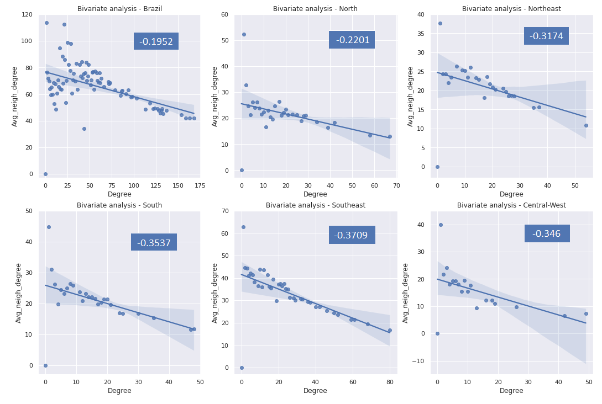
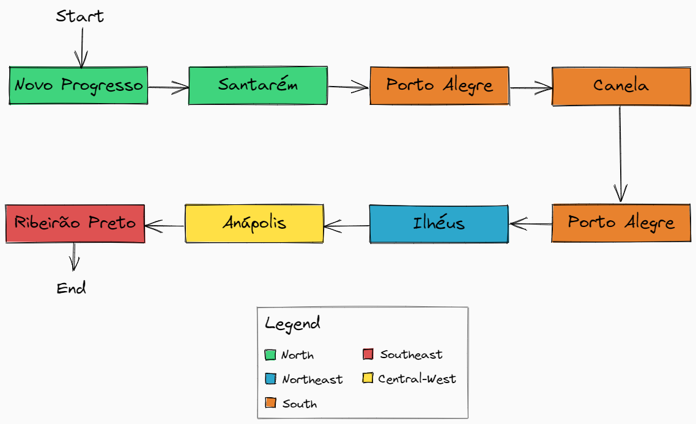

# Analysis about the flights network in Brazil

This work aims to perform an analysis on the Brazilian flight network and was done by [Mariana Azevedo](https://github.com/marianabritoazevedo/data-structure-ii/tree/main/flights-brazil) and [Thaís Medeiros](https://github.com/thaisaraujom/algorithms_datastructure_ii/tree/main/brazil_air_traffic). For this, the dataset present in the [Álvaro's Repository](https://github.com/alvarofpp/dataset-flights-brazil) was used.

Thus, questions 1 to 4 proposed in a data structure activity related to graphs will be solved, studying several properties of this network: assortativity, degree assortativity, connected componentes and shortest path.

## Assortativity

In a network, it is possible to analyze the propriety called _assortativy_.  From this, you can determine whether the network is assortativity or not, that is, analyze how connected the nodes are to each other. There are two ways to perform this analysis: by attribute (categorical or numerical) or by degree, which can be seen in the following example.

<p align="center" style="text-align:center">
    
</p align="center">

According to the figure below, you can see that the brazilian flight network can be assortativity, since the extremities are quite dark, indicating that elements of the same group tend to connect more. However, it is also possible to observe that there are many connections between elements from different groups.

<p align="center" style="text-align:center">
    
</p align="center">

With this, the assortativity coefficient based on a give node atribute was calculated, obtaining a value of approximately `0.37`, which indicates that the network assortativity, since it is positive. In addition, the generated matrix, with its values assigned to the table below, this property of assortativity is strengthened.

 Region           |    1    |     2      |      3     |      4     | 5 
 :--------:| :--------: | :------:   | :--------: | :--------: | :--------:
1| **0.07358156** | 0.01340869 | 0.04022606 | 0.0120789  | 0.0070922
2| 0.01340869 | **0.0802305**  | 0.05474291 | 0.0106383  | 0.01983599
3| 0.04022606 | 0.05474291 | **0.17309397** | 0.03390957 | 0.02759309
4| 0.0120789  | 0.0106383  | 0.03390957 | **0.13453014** | 0.02293883
5| 0.0070922  | 0.01983599 | 0.02759309 | 0.02293883 | **0.05363475**


## Degree assortativity

It was proposed to perform a bivariate analysis between the degree of the vertex and the average number of neighbors. First of all, it's important to understand the concept of assortativity, as it was explained above, and then, understand better the concept of degree assortativity, which is one way to check the assortativity in a network.

This property bases the assortativity by the degree of the nodes, and the degree assortativity can be measured with the Pearson's correlation coefficient. This coefficient can variate between -1 and 1, where:

*   -1: the network is extremely disassortativity (according to the degree), in other words, different elements connect with each other (in this case, nodes with high degree connect with nodes with low degree);
*    1: the network is extremely assortativity (according to the degree), in other words, similar elements connect with each other (in this case, nodes with high degree connect with nodes with high degree)

Understanding that, it was made an analysis of the degree assortativity using the `degree_assortativity_coefficient` function and making a visual analysis between the degree of the vertex and the average number of neighbors for the airports in Brazil and for the airports for each region of Brazil individualy. The image below shows the results obtained:



It is possible to notice that airports in Brazil, both nationally and regionally, are disassociative, since they all have negative degree assortativity coefficients. This means that airports with many connections do not necessarily connect only to airports with many connections.

## Connected components

The network is not connected and has 6 connected components. For each of them, an analysis was performed considering all five regions of Brazil in quantity and percentage. 

Thus, for each connected component, the values obtained can be visualized in the figure below.

<p align="center" style="text-align:center">
    
</p align="center">

## Shortest path

To understand the concept of shortest path, it was proposed to study the following simulated scenario, where it would be made a trip with the following route:

*   City 1 (North) to city 2 (South)
*   City 2 (South) to city 3 (Northeast)
*   City 3 (Northeast) to city 4 (Central-West)
*   City 4 (Central-West) to city 5 (Southeast)

To create this simulated scenario, five cities were chosen, one from each region of Brazil, and they were related to their respective airports through the creation of a dictionary. Below are the cities and airports chosen for each Brazilian region:

Region       | Airport | City
:--------:   | :------:| :--------:
North        | SNNG    | Novo Progresso
Northeast    | SBIL    | Ilhéus
South        | SSCN    | Canela
Southeast    | SBRP    | Ribeirão Preto
Central-West | SBAN    | Anápolis

Then, for each path, `shortest_path` and `shortest_path_length` functions from `nxviz` library were used to calculate the shortest path and its length, respectively. Below, it's possible to check the image with the complete route taken from city 1 to city 5, whose route size is 7, and then the route taken in each path of the complete route is verified.



Table with each path:

Path                                           | Path length 
:--------------------------------------------  | :------:
City1 (Novo Progresso) -> City2 (Canela)       | 3   
City2 (Canela) -> City3 (Ilhéus)               | 2   
City3 (Ilhéus) -> City4 (Anápolis)             | 1    
City4 (Anápolis) -> City5 (Ribeirão Preto)     | 1    

## How to run

1. Clone this repository

```
git clone https://github.com/thaisaraujo2000/algorithms_datastructure_ii.git
```

3. Import to Google Colab the file `flights_brazil.ipynb`

4. Run all the cells

## References
- [Álvaro's Repository](https://github.com/alvarofpp/dataset-flights-brazil)
- [Ivanovitch's Repository](https://github.com/ivanovitchm/datastructure)
